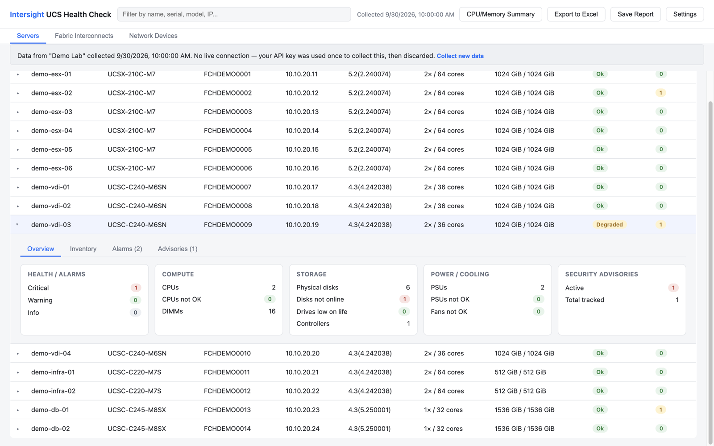
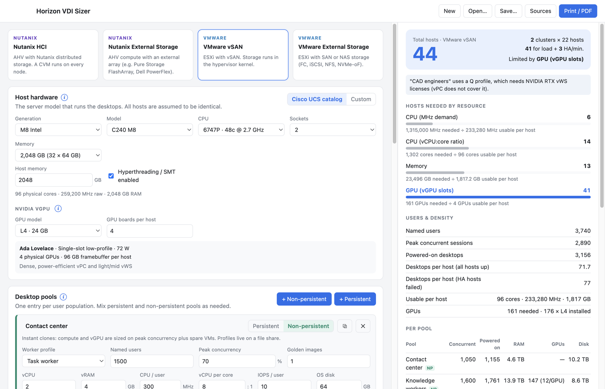

# Datacenter Tools

Free desktop tools for data center health checks and VDI sizing, for **macOS** (Apple silicon) and **Windows** (x64 and ARM64).

| Tool | What it does | Download | Manual |
|---|---|---|---|
| [**Intersight UCS Health Check**](#intersight-ucs-health-check) | Health, inventory, fabric and advisory report for Cisco UCS from Cisco Intersight, plus Dell/HPE capacity from RVTools and an Excel refresh-sizing workbook | [Release page](https://github.com/ppespepe/datacenter-tools/releases/tag/intersight-ucs-health-check-v0.1.0) | [PDF](docs/Intersight%20UCS%20Health%20Check%20-%20User%20Manual.pdf) |
| [**Horizon VDI Sizer**](#horizon-vdi-sizer) | Host sizing for Omnissa Horizon VDI on Nutanix or VMware, with persistent/non-persistent pools and NVIDIA vGPU | [Release page](https://github.com/ppespepe/datacenter-tools/releases/tag/horizon-vdi-sizer-v0.1.0) | [PDF](docs/Horizon%20VDI%20Sizer%20-%20User%20Manual.pdf) |

---

## Intersight UCS Health Check

- **Servers:** inventory (CPUs, DIMMs, disks, controllers, PSUs, fans), alarms, SSD wear, and Cisco security and end-of-life advisories.
- **Fabric Interconnects:** ports, real uplink traffic (where Intersight telemetry is available), and best-practice checks per UCS domain.
- **Nexus and MDS switches** managed by Intersight.
- **Dell, HPE and other hosts** from an RVTools export.
- **CPU/Memory Summary** with SPECrate®2017/2026 estimates from spec.org results.
- **Excel export** of everything, including a *Sizing & Staging* sheet for planning Cisco UCS M7/M8 replacements per cluster.
- **Save Report** lets you browse the data offline later without an API key.

**Your API key is never written to disk.** It's used once to collect the data, then discarded.

| File | Platform |
|---|---|
| [`Intersight.UCS.Health.Check-0.1.0-arm64.dmg`](https://github.com/ppespepe/datacenter-tools/releases/download/intersight-ucs-health-check-v0.1.0/Intersight.UCS.Health.Check-0.1.0-arm64.dmg) | macOS, Apple silicon |
| [`Intersight.UCS.Health.Check.Setup.0.1.0.exe`](https://github.com/ppespepe/datacenter-tools/releases/download/intersight-ucs-health-check-v0.1.0/Intersight.UCS.Health.Check.Setup.0.1.0.exe) | Windows 10/11, x64 and ARM64 |
| [User manual (PDF, 17 pages)](docs/Intersight%20UCS%20Health%20Check%20-%20User%20Manual.pdf) | |

---

## Horizon VDI Sizer

- **Platforms:** Nutanix HCI, Nutanix with external storage, VMware vSAN, and VMware with external storage, each with its own editable overheads.
- **Pools:** persistent (full clones) and non-persistent (instant clones) desktops, with worker-profile presets.
- **NVIDIA vGPU:** L4, L40S, L40, A16, A40, A10, A2, RTX PRO 6000 Blackwell (and the legacy T4), with vPC (B) and RTX vWS (Q) profiles.
- **Hosts:** the Cisco UCS M7/M8 catalog or any custom server.
- **Results:** hosts needed per resource and the limiting one, clusters with N+X HA, storage capacity and IOPS, and the Horizon management VMs.
- **Sources panel:** every default is labeled as vendor-documented, vendor guidance or a field rule of thumb, with links.

| File | Platform |
|---|---|
| [`Horizon.VDI.Sizer-0.1.0-arm64.dmg`](https://github.com/ppespepe/datacenter-tools/releases/download/horizon-vdi-sizer-v0.1.0/Horizon.VDI.Sizer-0.1.0-arm64.dmg) | macOS, Apple silicon |
| [`Horizon.VDI.Sizer.Setup.0.1.0.exe`](https://github.com/ppespepe/datacenter-tools/releases/download/horizon-vdi-sizer-v0.1.0/Horizon.VDI.Sizer.Setup.0.1.0.exe) | Windows 10/11, x64 and ARM64 |
| [User manual (PDF, 19 pages)](docs/Horizon%20VDI%20Sizer%20-%20User%20Manual.pdf) | |

---

## First launch (both tools)

The installers aren't code-signed yet, so the operating system warns you the first time:

- **macOS:** after dragging the app to Applications, **right-click → Open → Open**. On recent macOS versions you may instead need **System Settings → Privacy & Security → Open Anyway**.
- **Windows:** on the "Windows protected your PC" screen, click **More info → Run anyway**.

You only need to do this once.

## Privacy

- Both tools run entirely on your computer. There are no accounts, no telemetry, and no data is sent anywhere.
- The Intersight tool connects only to the Intersight URL you enter, and only when you click **Test connection** or **Collect**.
- All screenshots here and in the manuals use invented demo data.

## License

Both tools are **freeware** under the [Datacenter Tools Freeware License](LICENSE.txt):

- ✅ Free to use, for personal or business purposes, on any number of computers. You can share the reports and workbooks you create.
- 🚫 Don't modify, resell or redistribute the installers. To share the tools, link to this page instead.
- ⚠️ Provided **as is**, with no warranty and no liability. Results are planning estimates you should validate.

The installers show the license before installation.

## Disclaimer

These are independent tools. They aren't official products of, or supported by, Cisco, Omnissa, Broadcom/VMware, Nutanix or NVIDIA. Product names are trademarks of their owners.
Sizing results are planning estimates. Validate them with assessment data and a pilot before ordering hardware.
